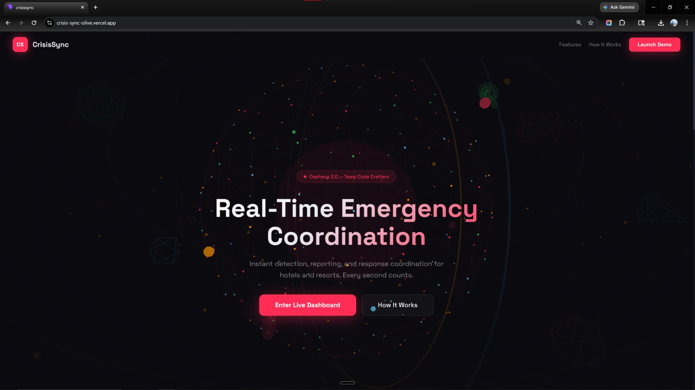
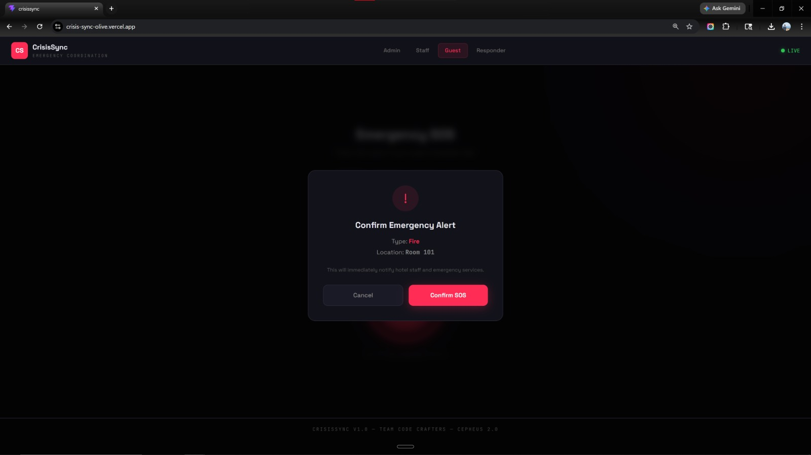
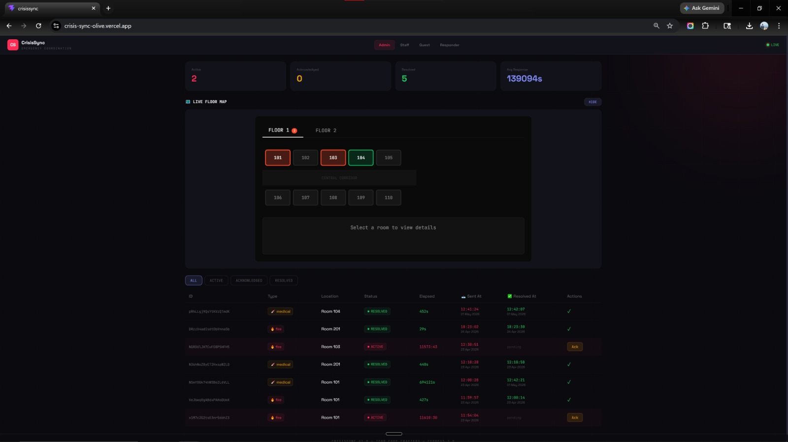
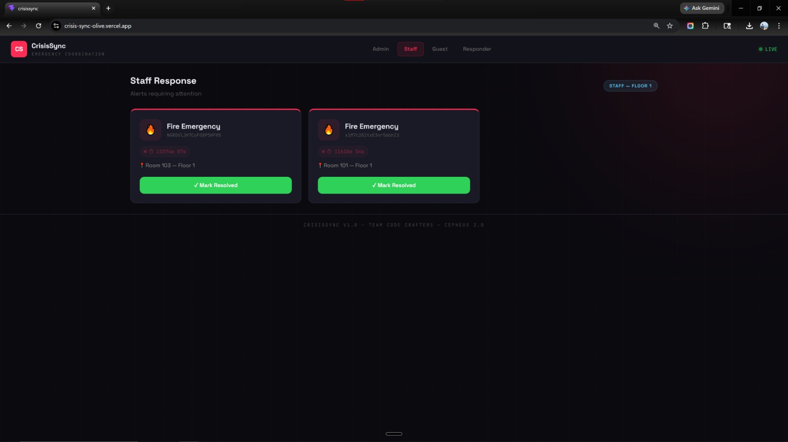
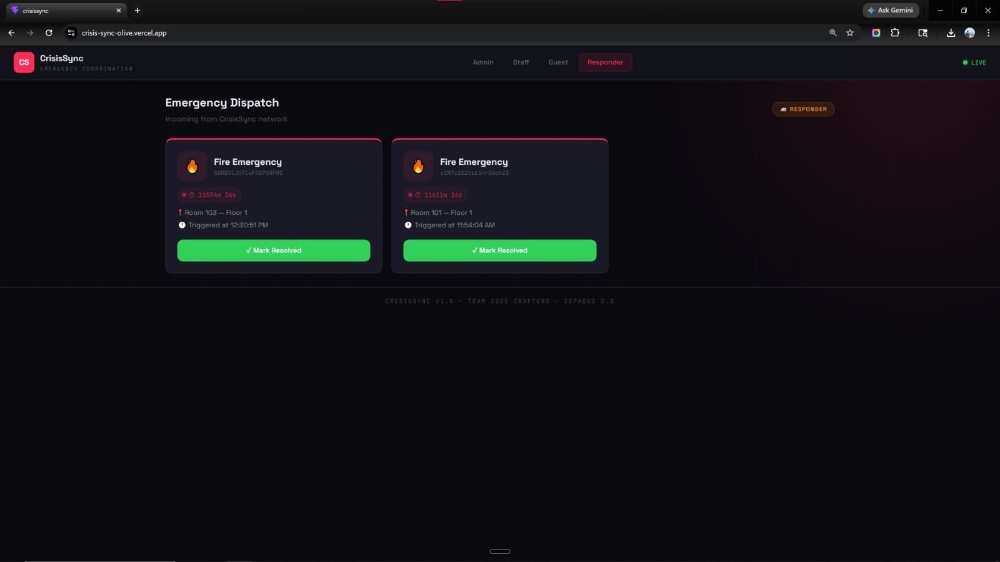
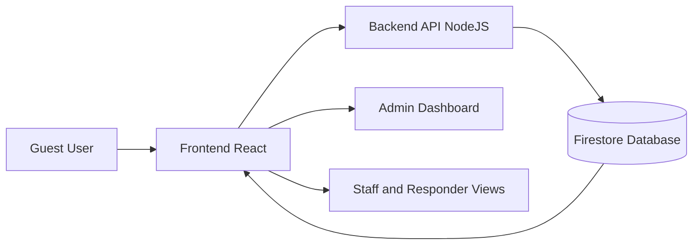

# 🚨 CrisisSync — Real-Time Emergency Response & Coordination Platform

> Real-time emergency alert and response coordination system built for **Cepheus 2.0** by **Team Code Crafters**

## 🌐 Live Demo

👉 https://crisis-sync-olive.vercel.app/

---

## 📸 Preview

### 🏠 Landing Page



### 🚨 SOS Trigger (Guest View)



### 👨‍💼 Admin Dashboard



### 🧑‍🚒 Staff Dashboard



### 🚑 Responder View



---

## 📌 Overview

CrisisSync is a full-stack emergency coordination platform that enables guests, staff, and responders to communicate and act on crises in real time. Whether it's a fire, medical emergency, or security threat — CrisisSync ensures instant notification and full lifecycle tracking from SOS trigger to resolution.

---

## 🎯 Problem Statement

Design a system that can:

* Detect and manage emergency alerts in real-time
* Provide a centralized dashboard for monitoring
* Enable quick response actions
* Visually represent incidents

---

## ✨ Features

| Feature                | Description                    |
| ---------------------- | ------------------------------ |
| 🔴 One-tap SOS Trigger | Instant alert creation         |
| 📡 Live Alert Feed     | Real-time Firestore updates    |
| 🗺️ Live Floor Map     | Room-level visualization       |
| 👥 Role-based Views    | Admin, Staff, Responder, Guest |
| ✅ Ack & Resolve        | One-click actions              |
| 📊 Stats Dashboard     | Alert analytics                |
| ⏱️ Live Timer          | Tracks urgency                 |
| 🔒 Anonymous Auth      | No login required              |
| ☁️ Firestore           | Real-time backend              |

---

## 🧠 System Architecture



* Event-driven real-time system
* Firestore listeners enable live updates
* Instant UI sync across all roles

---

## 🛠️ Tech Stack

### Frontend

* React + Vite
* Three.js
* Firebase SDK
* Vercel

### Backend

* Node.js + Express
* Firebase Admin SDK
* Render

---

## 🗂️ Project Structure

```
CrisisSync/
├── crisissync-frontend/
├── crisissync-backend/
├── assets/
└── README.md
```

---

## 🚀 Getting Started

### Prerequisites

* Node.js v18+
* Firebase project (Firestore + Auth)

### Clone

```bash
git clone https://github.com/jishnu395/CrisisSync.git
cd CrisisSync
```

---

## 🔐 Environment Variables

### Frontend (`crisissync-frontend/.env`)

```env
VITE_API_URL=
VITE_FIREBASE_API_KEY=
VITE_FIREBASE_AUTH_DOMAIN=
VITE_FIREBASE_PROJECT_ID=
```

### Backend (`crisissync-backend/.env`)

```env
PORT=5000
FIREBASE_PROJECT_ID=
FIREBASE_CLIENT_EMAIL=
FIREBASE_PRIVATE_KEY=
```

⚠️ Do NOT commit `.env` files
👉 Use `.env.example`

---

### Run Frontend

```bash
cd crisissync-frontend
npm install
npm run dev
```

### Run Backend

```bash
cd ../crisissync-backend
npm install
node index.js
```

---

## 🔄 Alert Lifecycle

```
ACTIVE → ACKNOWLEDGED → RESOLVED
```

---

## 🚧 Limitations & Future Improvements

### Current Limitations

* Single-floor view
* Basic role handling
* No push notifications

### Future Improvements

* Multi-floor support
* Firebase notifications
* Role-based auth
* Mobile app
* Analytics dashboard

---

## 💡 Why This Project Matters

* Real-time system design
* Event-driven architecture
* Role-based workflows
* Practical emergency solution

---

## 👥 Team

Built by **Team Code Crafters** during **Cepheus 2.0 Hackathon**
*(Individual contributor names intentionally omitted)*

---

## 📄 License

MIT License
